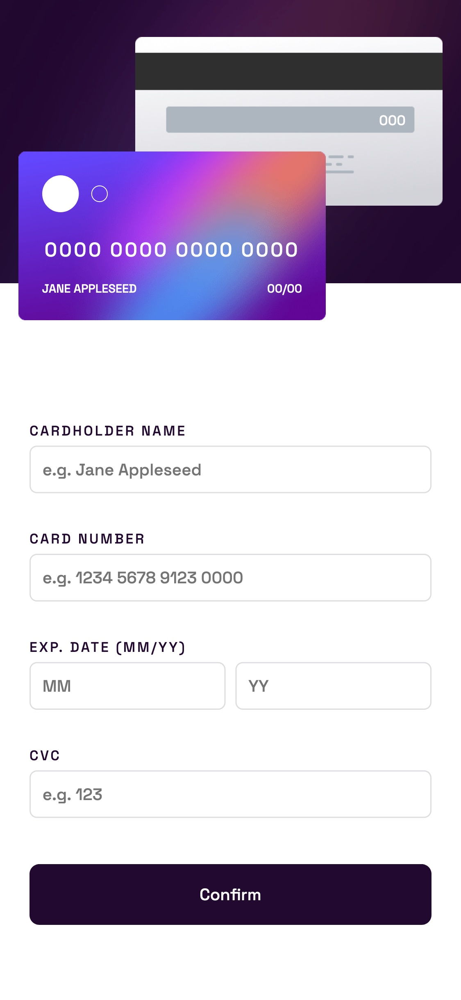
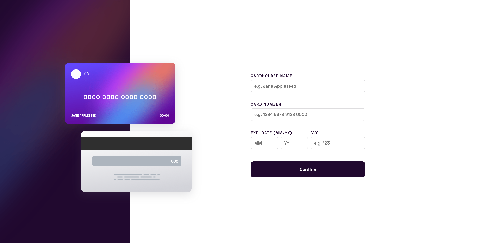

# Interactive Card Details Form

This is a solution to the [Interactive card details form challenge on Frontend Mentor](https://www.frontendmentor.io/challenges/interactive-card-details-form-XpS8cKZDWw). Frontend Mentor challenges help you improve your coding skills by building realistic projects.

## Table of contents

- [Overview](#overview)
  - [The challenge](#the-challenge)
  - [Screenshots](#screenshot)
  - [Links](#links)
- [My process](#my-process)
  - [Built with](#built-with)
  - [Lessons learned](#what-i-learned)
- [Author](#author)
- [Acknowledgments](#acknowledgments)

## Overview

### The challenge

Users should be able to:

- Fill in the form and see the card details update in real-time
- Receive error messages when the form is submitted if:
  - Any input field is empty
  - The card number, expiry date, or CVC fields are in the wrong format
- View the optimal layout depending on their device's screen size
- See hover, active, and focus states for interactive elements on the page

### Screenshot

The interactive card details form was designed mobile first, and it looks great on any size device. Here are a couple screenshots of the finished product.

Mobile version:

<div align="center">

</div>

<br />
<br />

Desktop version:

<p align="center">

</p>

### Links

- View the Code: [Add solution URL here](https://your-solution-url.com)
- Live Site URL: [Add live site URL here](https://your-live-site-url.com)

## My process

### Built with

- Mobile first workflow
- [React](https://reactjs.org/) - JS library
- Vite
- Semantic HTML5 markup
- Vanilla CSS
- Flexbox

### Lessons learned

Surprisingly, the most difficult part of this challenge was creating gradient borders on the input fields when they are in a focused state. There isn't a simple solution to this problem, but through some research, I was able to find an adequate solution.

The focused state gradient borders were achieved using the following technique:

```html
<input type="text" className="text-input" />
```

```css
:root {
  --white: hsl(0, 0%, 100%);
  --light-gray-violet: hsl(270, 3%, 87%);
  --input-gradient: linear-gradient(
    to left,
    var(--light-violet),
    var(--medium-violet)
  );
}

.text-input {
  padding: 0.6rem;
  border-radius: 6px;
  border: 1px solid var(--light-gray-violet);
  min-width: 30px;
}

.text-input:focus {
  /* add gradient border */
  outline: none;
  border: double 1px transparent;
  background-image: linear-gradient(var(--white), var(--white)), var(--input-gradient);
  background-origin: border-box;
  background-clip: padding-box, border-box;
  background-color: var(--white);
}
```

Another challenge was formatting the 16 digit card number into the familiar 4 digit groups as seen on most credit cards. This was achieved using a formatting function that executed before updating the card number state during the text input's onChange event.

```tsx
const formatNumber = (number: string) =>
  number.split("").reduce((seed, next, index) => {
    if (index !== 0 && !(index % 4)) seed += " ";
    return seed + next;
  }, "");
```

## Author

- Website - [brandondykun.com](https://brandondykun.com)

## Acknowledgments

- Shout out to [Frontend Mentor](https://www.frontendmentor.io/) for providing the guidelines and resources necessary to complete this challenging and educational mini project.
